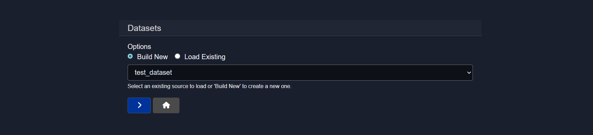
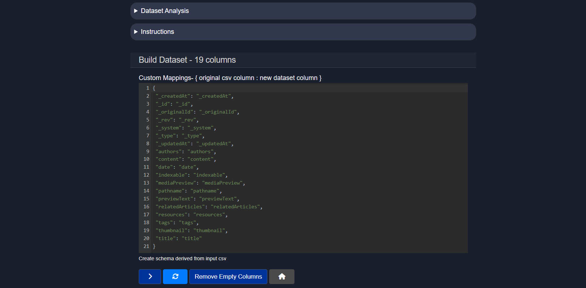
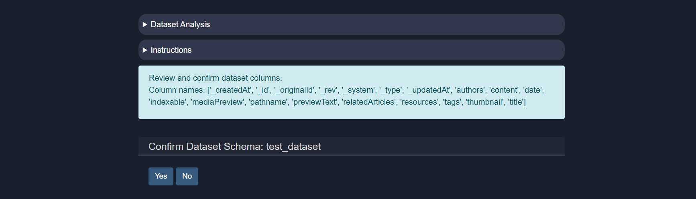
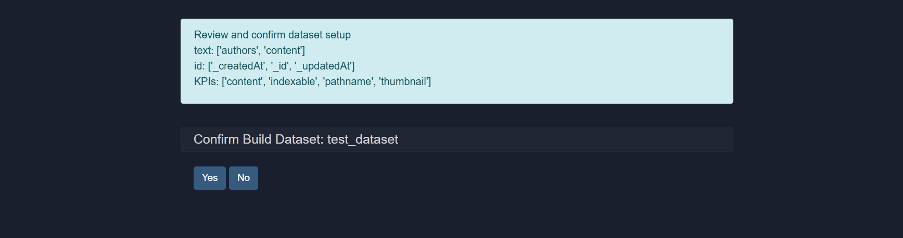
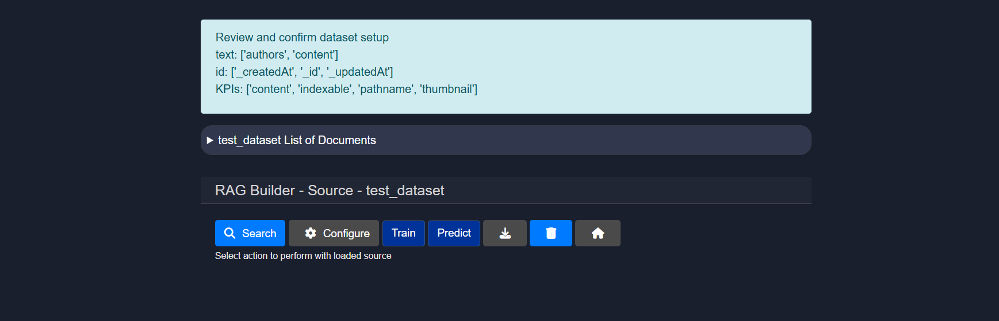
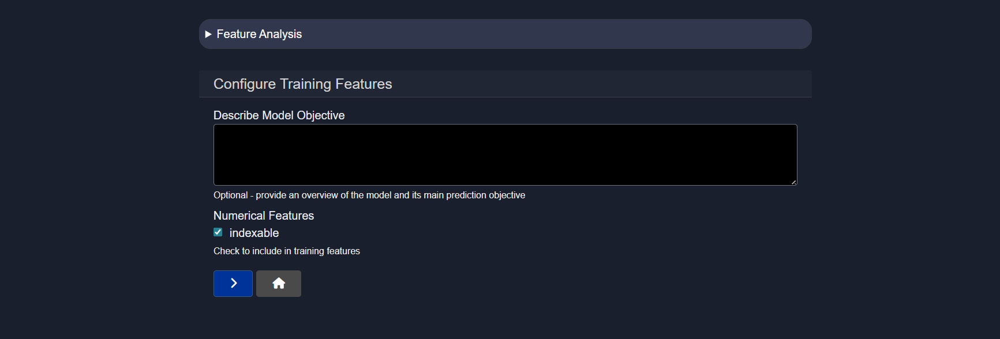

# Exploring datasets in Model HQ
After completing the initial setup, users will be directed to the **Main Menu**. This interface provides access to several powerful features. In this section, the **Dataset** feature will be described, which is a specialized form of Retrieval-Augmented Generation (RAG) optimized for structured data sources.

Datasets in Model HQ enable knowledge bases to be created from structured data sources such as CSV and JSON files. Unlike standard document-based sources that work with unstructured content, datasets are designed to handle tabular data with well-defined rows and columns. This approach allows AI models to perform semantic searches, predictive analysis, and data-driven question answering directly on structured data. Datasets can be configured with specific roles for different columns—designating which columns contain retrievable text, unique identifiers, and key performance indicators—enabling more intelligent and precise querying and analysis of tabular information.

## 1. Launching the dataset interface
To begin, the **Dataset** button in the main menu sidebar can be selected.

## 2. Creating a dataset
To create a dataset, the **build new** button can be selected. If previous datasets have been created, both **load existing** and **build new** options will be visible; otherwise, only **build new** will be available.

When `build new` is selected, an interface will be presented where the dataset name can be entered, the encryption type can be chosen, and the source type can be designated before proceeding to the next step.

### 2.1 Adding a dataset
Once the form is completed, a file upload prompt will be presented. The file should have a well-defined row-column structure and will serve as the dataset source. Supported file types include `.csv` and `.json`.

### 2.1.1 Master schema
If a previous dataset source exists, that dataset can be leveraged to establish a master schema for the current dataset being created. This enables consistency across multiple datasets with similar structures.

### 2.2 Mapping
Once a file is added, the schema will be automatically fetched and mapping will be performed automatically. The mapping can be cross-checked for accuracy and updated as needed to ensure proper field alignment and data type classification.

### 2.3 Confirm the dataset schema
In this window, confirmation of the dataset schema will be requested. Comprehensive dataset details—including dataset analysis and instructions for dataset setup—will be provided for review.

### 2.4 Dataset configuration setup
This is a three-step configuration process in which three essential questions will be presented. One or multiple fields from the provided dataset should be selected for each step to define how the dataset will be indexed and queried.

**Step 1: RAG/Retrieval Columns**
"Which columns have the text to be used for RAG/Retrieval processes?"

Columns designated for RAG/Retrieval are those containing textual information that will be searched and retrieved when queries are executed. These columns form the basis of semantic search and retrieval in the dataset.

**Selection guidance:**
- **Purpose**: Columns selected here will be indexed for semantic similarity search. When users ask questions, the AI model will search these columns to find relevant information.
- **Examples**: In a product dataset, columns like "Product Description", "Features", or "Customer Reviews" would be RAG columns. In an HR dataset, columns like "Job Description", "Requirements", or "Responsibilities" would be appropriate for RAG.
- **Multiple selections**: Multiple columns can be selected if textual information is distributed across several fields. For example, a dataset might have both "Title" and "Content" columns that should both be searchable.
- **Impact**: Only columns selected here will be included in the semantic search index. Unselected columns can still be used for filtering or display but won't contribute to relevance ranking.

**Step 2: ID Column**
"Which column(s), if any, represent a unique identifier for each row, e.g., reference number?"

ID columns establish unique identifiers for each record in the dataset, enabling precise referencing and tracking of individual records during retrieval and analysis.

**Selection guidance:**
- **Purpose**: ID columns uniquely identify each row in the dataset. They serve as primary keys that distinguish one record from all others.
- **Examples**: In a product dataset, "Product ID" or "SKU" would be ID columns. In a customer database, "Customer ID" or "Email" might serve as identifiers. In a document collection, "Document ID" or "Reference Number" would be appropriate.
- **Single or multiple**: While typically one ID column is preferred, some datasets might use composite IDs (multiple columns together form the unique identifier).
- **Impact**: When results are returned from a query, the ID column helps users identify exactly which records were retrieved. This is crucial for data integrity and tracking.
- **Optional**: If no clear identifier exists, this field can be left empty. The system will still function, but individual record tracking will be less precise.

**Step 3: KPI Definition**
"Define the main performance indicators for the dataset"

Key Performance Indicators (KPIs) are quantifiable metrics that represent important business or analytical values within the dataset. These fields are often used for aggregation, analysis, and prediction tasks.

**Selection guidance:**
- **Purpose**: KPIs are numerical or categorical fields that represent important metrics or outcomes being tracked. These columns are often used for predictive modeling, trend analysis, and performance evaluation.
- **Examples**: In a sales dataset, KPIs might include "Revenue", "Sales Amount", "Conversion Rate", or "Customer Lifetime Value". In a healthcare dataset, KPIs could be "Patient Recovery Time", "Treatment Success Rate", or "Cost per Treatment". In an analytics dataset, "Click-Through Rate", "Engagement Score", or "User Growth" would be KPIs.
- **Multiple indicators**: Several KPI columns can be defined if the dataset tracks multiple important metrics. For instance, an e-commerce dataset might have both "Sales" and "Customer Satisfaction Score" as KPIs.
- **Numerical vs. Categorical**: KPIs are typically numerical (like revenue or count), but categorical KPIs (like "Status: Active/Inactive") can also be important for analysis.
- **Impact**: Designated KPIs enable the AI model to focus analysis and predictions on the most business-critical fields. They also facilitate comparative analysis and trend tracking over time.

Once these three steps are completed, confirmation of the dataset configuration will be requested again.

### 2.5 RAG Builder
Once dataset configuration is complete, the RAG Builder interface is presented, providing tools to search, configure, train, and analyze the dataset.

### 2.6 Search
The search functionality for dataset sources operates identically to the standard source search described in the [Source documentation](). Queries can be formulated using semantic search, keyword-based matching, or exact phrase matching to retrieve relevant records from the dataset.### 2.7 Configure
This option allows the Dataset Configuration setup to be reconfigured. If the initial column designations (RAG columns, ID columns, or KPIs) need to be modified, the configuration can be adjusted at any time.

### 2.8 Train (BETA)
The **Train** option enables a target variable to be defined that will be predicted or fitted using a machine learning model. This feature allows predictive models to be built on dataset columns.

In this step, the **train variable** (for example, a target outcome column) that represents the output the model should learn to predict can be specified.

* **Train Variable**
  The name of the column to be used as the training target should be entered. This is the variable that the ML model will attempt to predict based on other features in the dataset.

  * If the column already exists in the dataset, it will be used directly.
  * If the column name does not exist in the current schema, it will be added.
  * If the field is left blank, the training configuration will be ignored and no ML model will be trained.

> [!NOTE]
> The train variable should be a column that has clear, well-defined values. Sparse or incomplete columns may result in poor model performance.

After clicking next, confirmation will be requested to finalize and begin training an ML model on this dataset with the specified target variable.

### 2.9 Predict
The **Predict** option is used to define the features and objective that will be used during model prediction and feature analysis. This configures what the trained model will predict and which dataset columns will be used as input features.

This interface allows the intended prediction objective to be described and the features that should participate in training to be selected.

* **Describe Model Objective**
  An optional high-level description of the model and its primary prediction goal can be provided. This documentation helps clarify the intent of the model and improves understanding during review and collaboration.
  
  Example: "Predict customer churn probability based on customer behavior and engagement metrics" or "Forecast monthly revenue based on historical sales patterns and seasonal indicators"

* **Numerical Features**
  Numerical columns that should be included as training features can be selected. These are the input variables that the model will use to make predictions.

  * Enabling a feature marks it as usable during model training and prediction.
  * Only selected features will be considered during feature analysis and model execution.
  * Features should be chosen based on their relevance to the prediction objective—include features that are believed to influence the target variable.

Once the required features are selected, the **Next ( > )** button can be clicked to continue, or the **Home** button can be used to exit the configuration flow.

## Conclusion

This document described how to work with datasets in Model HQ, a specialized feature designed for structured data sources such as CSV and JSON files. Datasets enable advanced capabilities beyond standard document-based RAG, including semantic search over tabular data, machine learning model training, and predictive analytics. The key to effective dataset usage is proper configuration during setup—designating which columns serve as retrievable text for search (RAG columns), which columns uniquely identify records (ID columns), and which columns represent important business metrics (KPIs). Once configured, datasets provide a complete workflow from data ingestion through search, analysis, and prediction. The Train and Predict features enable users to build machine learning models on their structured data, transforming static datasets into predictive tools. This makes datasets valuable not only for information retrieval but also for trend analysis, forecasting, and data-driven decision-making within organizations.
