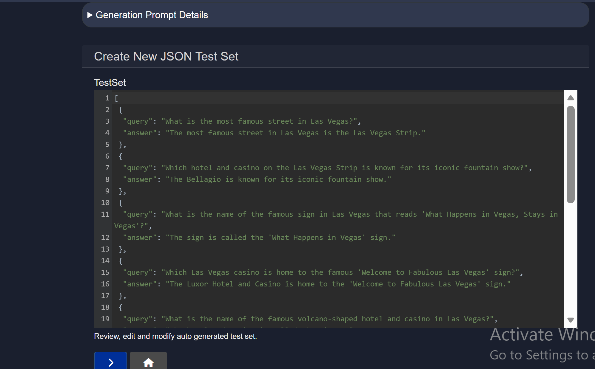
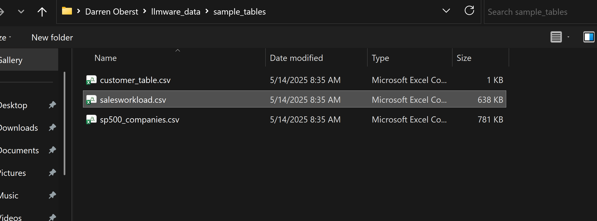
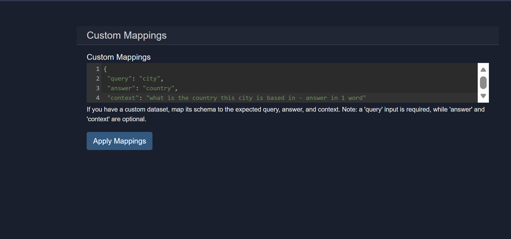
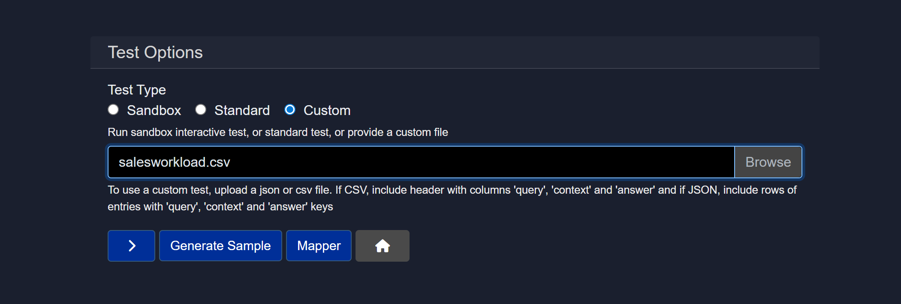
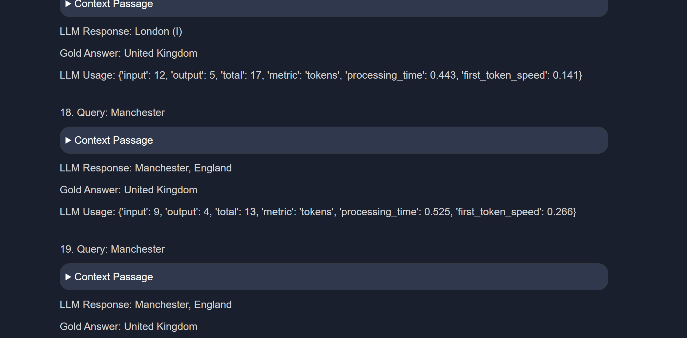

# How to Use and Create a Custom Test for Model Inferencing
This document describes how the Custom Test feature may be used to validate model inference in Model HQ. It explains the available test types, how files are uploaded and mapped, and how to generate or run custom test sets. Guidance is presented in an indirect, professional tone and is intended for users who wish to perform repeatable or batch evaluations of models.


## 1. Overview
### 1.1 Test Type
Defines the testing mode to be used.
1. Sandbox
2. Standard
3. Custom

<details><summary> Find the explanation of each section of here </summary>

1. **Sandbox**
Runs an interactive test session.

- Best for quick experimentation
- Allows manual prompts and real time inspection
- Default option for exploratory testing

2. **Standard**
Runs a predefined, system-controlled test using one of LLMWare's pre-made datasets which are largely designed to test a model's capability for RAG comprehension and answer generation.

- Useful for repeatable validation checks
- Requires no custom input files
- Suitable for baseline validation

3. **Custom**
This feature allows a user to run tests using user provided data.

- Enables batch evaluation
- Requires uploading a JSON or CSV file
- Designed for structured testing and benchmarking

</details>

### 1.2 File upload
The custom test mode depends on an uploaded dataset. The expected file formats and field mappings are described below.

#### 1.2.1 Choose file / Browse
- Upload a JSON or CSV file when Custom test type is selected
- CSV must include headers: `query`, `context`, `answer`
- JSON must contain entries with keys: `query`, `context`, `answer`
- Each row or entry represents one test case

#### 1.2.2 Action Buttons
**Run Test (>)**  
Initiates the selected test type using the current configuration.

* Executes sandbox, standard, or custom test
* Uses uploaded file if custom mode is selected

**Generate Sample**
Automatically creates a sample test file.

* Helps users understand the expected file format
* Useful as a starting template for custom tests

**Mapper**  
Opens the field mapping interface for custom test files.

* Allows mapping of uploaded file columns to required fields
* Useful when column names do not exactly match expected keys (`query`, `answer`, `context`)
* Prevents schema-related test failures
* Enables use of existing datasets without reformatting

Default mapping values:
```json
{
	"query": "query",
	"answer": "answer",
	"context": "context"
}
```

>> [!IMPORTANT]
>> When a custom dataset is used, the schema should be mapped to the expected fields: `query`, `answer`, and `context`. Note that `query` is required; `answer` and `context` are optional.

## 2. Creating a custom test

### 2.1 Generate custom test samples
A sample test file may be generated from the Models view. The typical flow is:

```
Models > [Select Model from Dropdown] > Test > Generate Sample
```

The interface will prompt for a sample query and will create a JSON test set based on that input. The generated set may be reviewed and edited prior to running or downloading.




After review, selecting ">" will present options to download the sample test or to run it immediately.


When the test is executed, the interface reports metrics such as token usage, total processing time, and first-token latency.


Upon completion, results may be downloaded or the user may return to the main view. The selected model will be downloaded automatically prior to the test if it is not already present in the local cache.

### 2.2 Using existing CSVs or JSON files (Custom Mapper)
When using complex datasets that do not follow the default schema, the Mapper may be used to align file fields with the required test fields.

- Allows mapping of uploaded file columns to required fields
- Enables use of existing datasets without reformatting
- Prevents schema-related test failures

Access path:

```
Models > [select model] > Test > Mapper
```

Default mapping values:
```json
{
	"query": "query",
	"answer": "answer",
	"context": "context"
}
```

- `query` represents the test question
- `answer` represents the gold or expected answer for the test case
- `context` represents any additional context or instructions supplied to the model

An example workflow is to select the appropriate columns from a provided CSV (for example, a local sales dataset), apply the mappings, and then run the test set.



After mappings are applied, the user selects the Custom test file and initiates the run by selecting ">".





During execution, the model processes each row and returns the model response along with timing metrics such as processing time and first-token speed.



### 2.3 Stopping a model test
- A running test may be stopped at any time by selecting the cancel control (X).

## 3. Recap: To use a custom test: Choose file / Browse
- Use Custom mode when batch evaluation is required
- Ensure the uploaded file conforms to the expected schema or apply mappings using the Mapper
- Generate a sample if unsure of the required format

## Conclusion
This document has described how the Custom Test feature may be used to create, map, and run test sets against a selected model. The guidance focuses on repeatable validation: generate a sample to learn the schema, apply mappings for existing datasets, and review the run-time metrics after execution. For troubleshooting and advanced configuration, consult the project's broader docs or the Integrations/Mapper help sections.
