# Exploring tools in Model HQ
The Tools section provides powerful utilities for managing local setup, development workflows, and system diagnostics within Model HQ. This centralized interface includes backend server controls, CLI access, development SDKs, model management utilities, and system information displays.

After completing the initial setup, users gain access to a comprehensive toolkit that supports both end-user and developer workflows. The Tools interface serves as a control center for advanced operations such as launching headless backend servers for API-based deployments, accessing command-line interfaces for scripted automation, downloading sample documents for testing, managing model installations, and diagnosing system capabilities. These tools enable power users and developers to extend Model HQ beyond its graphical interface, integrate it into larger systems, troubleshoot deployment issues, and optimize performance based on available hardware resources. Understanding the Tools section is essential for advanced configurations, programmatic access, and production deployments where Model HQ serves as a backend AI service rather than an interactive application.

## 1. Launching the tools interface
To begin, the **Tools** button (🔧) located in the top right side of the main menu can be selected.
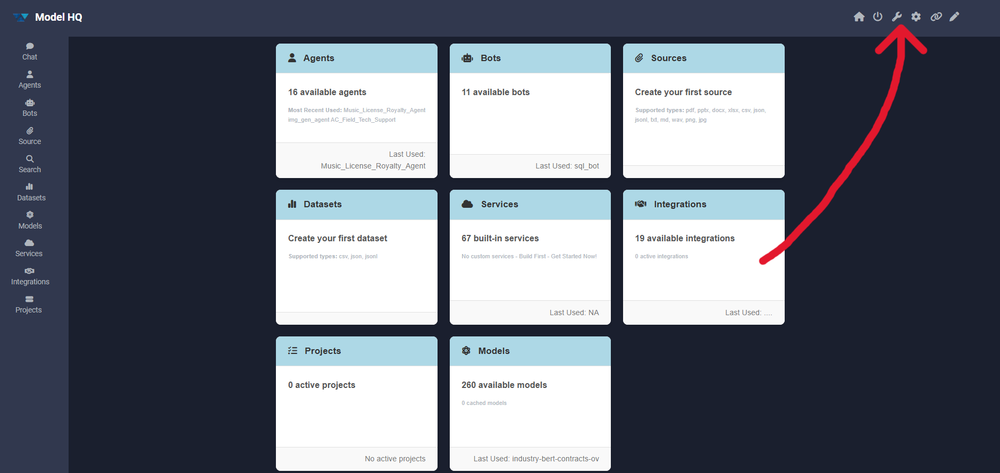


## 2. Tools interface overview
After launching the Tools section, the interface displays the following key options:

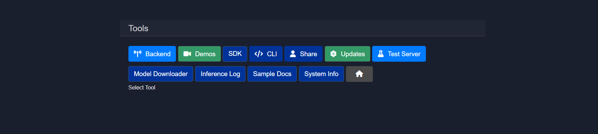

The tools interface provides access to the following utilities:

| Option | Description |
|--------|-------------|
| **Backend** | Launches the internal API server in headless mode for programmatic access |
| **Demos** | Accesses pre-built demonstrations for bots and agents |
| **SDK** | Downloads the Model HQ Client Tools Kit for IDE-based development |
| **CLI** | Opens a command-line interface terminal for advanced operations |
| **Share** | Enables session sharing over an external IP address for collaboration |
| **Updates** | Checks for and downloads new content, agents, templates, and SDK updates |
| **Test Server** | Verifies that the Model HQ server is functioning correctly |
| **Model Downloader** | Manages model downloads and completes standard model set installations |
| **Inference Log** | Stores and displays inference transaction logs from the database |
| **Sample Docs** | Downloads pre-curated document packages for testing parsing and RAG workflows |
| **System Info** | Displays detected system configuration including memory, processor, disk, and GPU details |

Each tool serves a specific purpose in the development, deployment, and diagnostic workflow of Model HQ.

## 3.1 Backend
The Backend option can be selected from the tools interface to initiate the backend API server in headless mode, which closes the user interface and enables direct API access.

This deployment mode is ideal for lightweight, modular scenarios where Model HQ operates as a backend service. Once launched, the server runs as a background process and can be accessed via `localhost` or over an external IP address—enabling private, local inference workflows or integration into larger systems.

A download link for the **Model HQ SDK** will be provided, containing all necessary libraries, sample code, and examples. The SDK package can be unzipped, opened in any preferred IDE, and used to interact with the backend APIs programmatically.

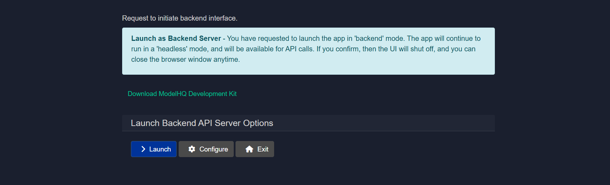

The backend interface includes two main options:

* **Launch**: The backend server can be started immediately.
* **Configure**: Configuration settings can be adjusted before starting the server.

Example usage with llmware Python client:
```py
from llmware.web_services import LLMWareClient
client = LLMWareClient(api_endpoint="http://0.0.0.0:8088")
response = client.inference(prompt="Who was the U.S. President in 1996?", model_name="phi-3-ov")
print("llm response:", response)
```

### 3.1.1 Launching backend server
Once the launch button is clicked, the backend will be initiated. Helpful tips will be displayed as shown in the screenshot.

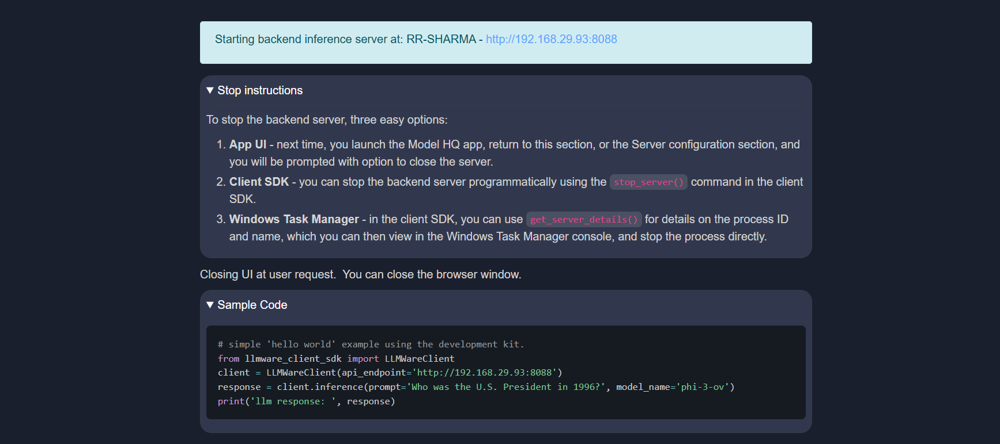

### 3.1.2 Configuring backend server
This step configures the Backend API Server for **Headless mode** operation. The backend server exposes APIs that agents, services, or external systems can invoke without relying on the graphical user interface.

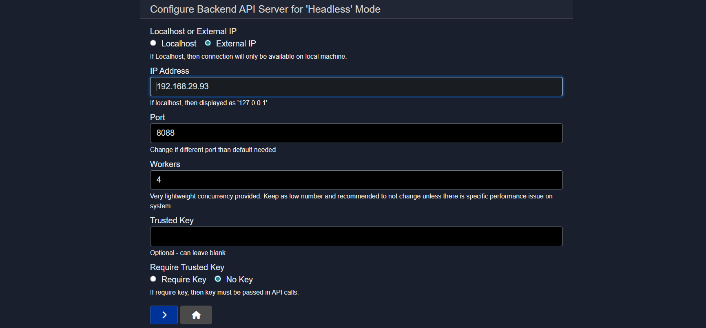

This configuration defines the server's network location, access method, concurrency limits, and optional security controls.

#### 3.1.2.1 Server Mode: Localhost or External IP

Choose how the backend server should be exposed.

**Options:**

* **Localhost**
  The server is bound to the local machine only. It will be accessible as `127.0.0.1` and cannot be reached from other devices or machines.
* **External IP**
  The server is bound to a network accessible IP address, allowing other machines, agents, or services to connect.

**When to use:**

* Use **Localhost** for development, testing, or single machine setups.
* Use **External IP** for shared environments, distributed agents, or production deployments.

#### 3.1.2.2 IP Address

Specifies the IP address on which the backend server will listen.

**Behavior:**

* If **Localhost** is selected, this is automatically treated as `127.0.0.1`.
* If **External IP** is selected, provide a valid internal or public IP address.

**Example:**

```
192.168.29.93
```

#### 3.1.2.3 Port

Defines the network port used by the backend server.

**Default example:**

```
8088
```

**Notes:**

* Change this only if the default port is already in use.
* Ensure the port is open and allowed through firewalls if using an External IP.

#### 3.1.2.4 Workers

Controls the number of lightweight worker processes handling concurrent requests.

**Example:**

```
4
```

**Guidelines:**

* Keep this value low by default.
* Increase only if you observe request bottlenecks or specific performance issues.
* Higher values may increase memory and CPU usage.

#### 3.1.2.5 Trusted Key

An optional shared secret used to secure API access.

**Behavior:**

* Can be left blank if security is handled elsewhere.
* If provided, clients must supply this key in API requests when key enforcement is enabled.

**Example:**

```
my-secure-backend-key
```

#### 3.1.2.6 Require Trusted Key

Controls whether the Trusted Key is mandatory for all API calls.

**Options:**

* **Require Key**
  All incoming API requests must include the trusted key.
* **No Key**
  API requests are accepted without authentication.

**Recommendation:**

* Enable **Require Key** for production or shared environments.
* Use **No Key** only for local development or isolated networks.

#### 3.1.2.7 Result

Once configured, the backend API server will start in headless mode using the defined network settings, concurrency limits, and security rules. This server becomes the primary execution and integration point for agents, MCP services, and external systems.


## 3.2 Demos
The **Demos** section contains all demonstrations that have been created or pre-existed for bots and agents. Demonstrations can be executed directly from this interface.


This provides quick access to test workflows and example implementations without navigating through the full bot or agent creation process.

## 3.3 SDK
The **Model HQ Client Tools Kit** (or Model HQ SDK) enables Model HQ to be run within an IDE environment and allows the backend server to be operated as described in the Backend section.

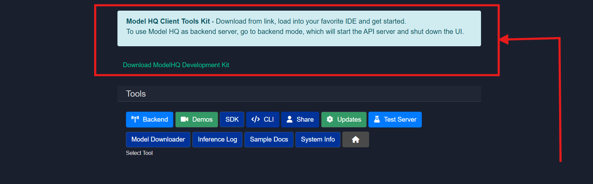

The SDK provides all necessary libraries, documentation, and code examples for programmatic integration with Model HQ's backend services.

## 3.4 CLI

The CLI option can be selected to open a separate command-line interface window where commands can be executed directly.

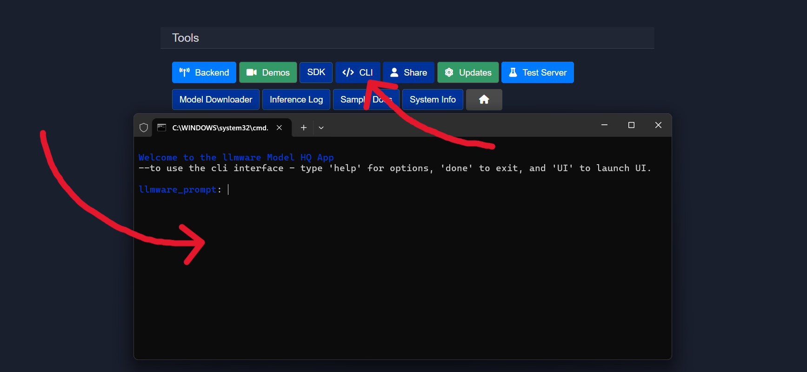

By selecting the CLI option, a second instance of the application will be created and exposed through a new terminal window. The CLI can be used to run chat sessions in parallel while the main application UI remains active.

To get started with CLI operations, the **help** command can be entered in the terminal to display all available commands and actions.

## 3.5 Share
The **Share Connection** feature can be used to transfer the session to an external IP address. This is particularly useful for collaboration or accessing the interface from another machine.

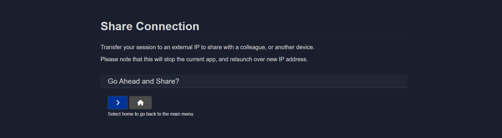

When sharing is enabled, the localhost connection will be closed and the Model HQ application will be transferred to an externally accessible IP address available over the network. Any device with corporate network access to that IP address can then be used to access the application, including smartphones, tablets, or other PCs.

> [!WARNING]
> Sharing will stop the current session and relaunch it with a new IP configuration.

> [!NOTE]
> The IP address and port should be entered into a browser on any network-connected machine to access the shared session.

> [!IMPORTANT]
> Firewall port settings may need to be adjusted to enable external connections.

## 3.6 Updates
The **Updates** feature can be used to check for additional content, including new agents, templates, demonstrations, and SDK tools.

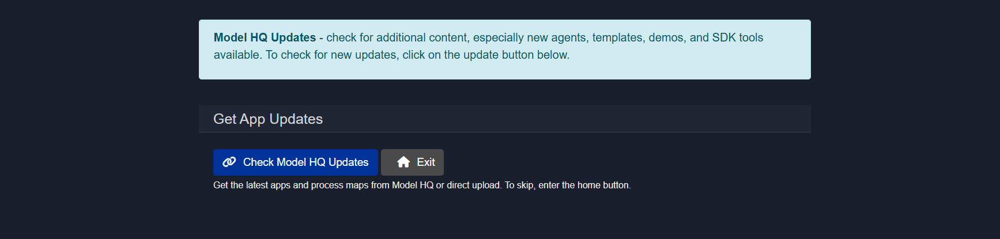

The update button can be clicked to check for and download newly available content and features.

## 3.7 Test server
The **Test Server** utility verifies whether the Model HQ server is functioning correctly.

This diagnostic tool confirms server responsiveness and basic operational status.

## 3.8 Model downloader
The **Model Downloader** manages the installation of the standard model set. 

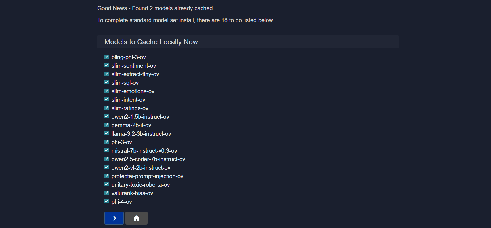

The interface displays which models remain to be downloaded to complete the standard model set installation. Models can be selected and downloaded as needed based on use case requirements.

## 3.9 Inference logs
Inference transactions can be stored in the database for logging and analysis purposes.

This feature maintains a record of all inference operations, enabling performance tracking, debugging, and usage analytics.

## 3.10 Sample documents
The **Sample Docs** option allows example document packages to be downloaded. These samples are useful for:

- Testing parsing pipelines
- Benchmarking extraction workflows
- Understanding document ingestion formats


The preferred document package can be selected and will be downloaded into the local workspace for testing and validation purposes.

## 3.11 System information
The **System Info** option can be selected to view hardware and software configurations detected by Model HQ.

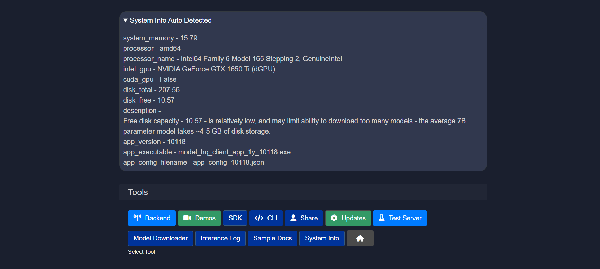

This diagnostic display helps assess whether the environment is suitable for downloading and running specific models. The system information includes details about available memory, processor type, disk space, and GPU availability. For detailed system requirements, the [System Configurations](https://github.com/RS-labhub/ModelHQ-Docs/tree/master/systemConfiguration/SYSTEM_CONFIGURATION.md) documentation can be consulted.

## Conclusion
This document described the comprehensive Tools interface in Model HQ, which provides essential utilities for advanced configuration, development, and system management. Key features include the Backend server launcher for headless API-based deployments, the CLI for command-line operations, the SDK for programmatic integration, and the Share function for collaborative access. Diagnostic tools such as System Info and Test Server enable users to verify hardware capabilities and server functionality before deploying models. The Model Downloader and Sample Documents features streamline the setup process by managing model installations and providing test data. The Demos section offers quick access to pre-built examples, while the Updates feature ensures access to the latest agents, templates, and tools. Together, these utilities transform Model HQ from a standalone application into a flexible platform that can be integrated into larger systems, accessed programmatically, and optimized based on available hardware resources. Understanding and utilizing the Tools interface is essential for power users, developers, and organizations deploying Model HQ in production environments or integrating it into existing workflows.